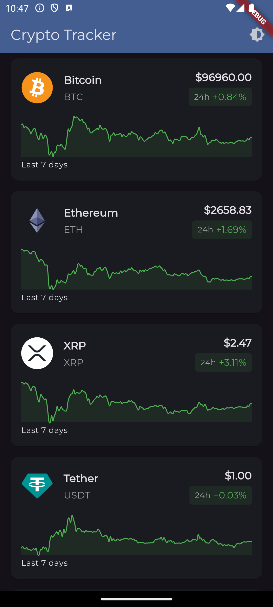
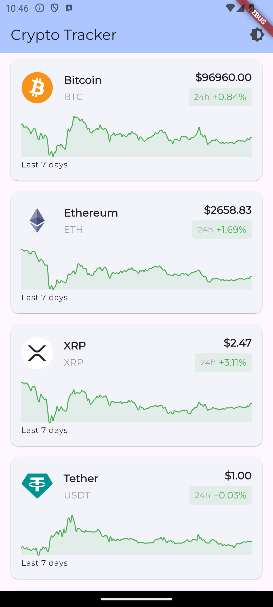

# Crypto Tracker

A Flutter application that displays real-time cryptocurrency data using the CoinGecko API.




## Features Implemented

From the original requirements:
- ✅ Display top 10 cryptocurrencies by market cap
  - Real-time data from CoinGecko
  - Price and 24h change
  - 7-day price chart visualization
  - Pull-to-refresh functionality
- ✅ Clean Architecture
  - BLoC pattern using Cubit
  - Separation of concerns (services, models, widgets)
  - Freezed for immutable state
- ✅ Error Handling
  - User-friendly error messages
  - Retry mechanism
  - Loading states
- ✅ UI/UX
  - Material Design 3
  - Dark/Light theme support
  - Responsive layout
  - Custom chart styling

## Technical Details
- State Management: flutter_bloc
- API Integration: http
- Code Generation: freezed
- Charts: fl_chart
- Typography: google_fonts

## Potential Improvements

- Persist theme preference using shared preferences
- Add searchbar to filter coins
- More robust error handling with different error types
- Add UI tests and golden tests
- Add caching for offline support
- Implement price alerts
- Add detailed coin view
- Add sorting options

### Installation

1. Clone the repository
2. Install dependencies:
```shell
flutter pub get
```
3. Generate code:
```shell
flutter pub run build_runner build --delete-conflicting-outputs
```
4. Run the app:
```shell
flutter run
```
